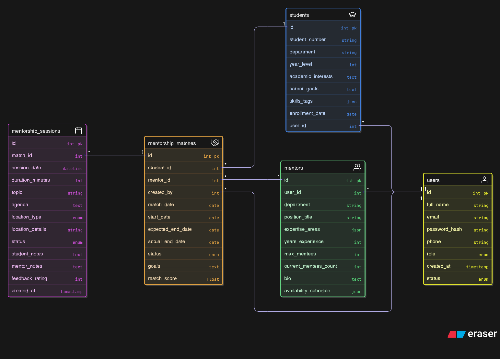

# Student Mentorship Program System - Storyboard

## Git Hub repo: ( https://github.com/HazhanHallwan/csc548-StudentMentorshipProgramSystem-group-ArwanAwat-HazhanHalwan-KizheOthman-MohammedHaydar )

## Project Information
**Project Title:** Student Mentorship Program System  
**Team Members:** 
Hazhan Halwan QIU23-0418 
Kizhe Othman QIU23-0423
Arwan Awat QIU23-0265
Mohammed Haydar QIU23-0421

**Course:** CSC584 ENTERPRISE PROGRAMMING	

**Deliverable:** 1 -- Group Project  Storyboard (HTML Flow) + Database ERD

## Purpose
This storyboard demonstrates the complete user flow and page structure for a web-based Student Mentorship Program System. The system facilitates matching students with mentors, scheduling sessions, and tracking mentorship progress.

## How to Navigate
1. Start at `index.jsp` - the main sitemap that links to all pages
2. The system has four main modules:
   - **Authentication** (auth/): Login and registration
   - **Dashboard** (dashboard/): Overview with KPIs and charts
   - **Students Module** (students/): Full CRUD operations
   - **Mentors Module** (mentors/): Mentor management
   - **Matches Module** (matches/): Mentor-student pairing
   - **Sessions Module** (sessions/): Session scheduling and tracking

## Key Features
- User authentication (login/register)
- Dashboard with KPIs and analytics charts
- Complete CRUD for Students (list, create, view details, edit)
- Mentor registration and management
- Intelligent mentor-student matching
- Session scheduling and tracking
- Progress monitoring

## File Structure
StudentMentorshipSystem/
│
├── 📂 src/
│   └── 📂 java/
│       └── 📂 com/
│           └── 📂 mentorship/
│               │
│               ├── 📂 controller/
│               │   ├── 📄 LoginServlet.java
│               │   ├── 📄 LogoutServlet.java
│               │   ├── 📄 RegisterServlet.java
│               │   ├── 📄 DashboardServlet.java
│               │   │
│               │   ├── 📄 StudentCreateServlet.java
│               │   ├── 📄 StudentListServlet.java
│               │   ├── 📄 StudentDetailsServlet.java
│               │   ├── 📄 StudentEditServlet.java
│               │   ├── 📄 StudentUpdateServlet.java
│               │   ├── 📄 StudentDeleteServlet.java
│               │   │
│               │   ├── 📄 MentorCreateServlet.java
│               │   ├── 📄 MentorListServlet.java
│               │   ├── 📄 MentorDetailsServlet.java
│               │   ├── 📄 MentorEditServlet.java
│               │   ├── 📄 MentorUpdateServlet.java
│               │   ├── 📄 MentorDeleteServlet.java
│               │   │
│               │   ├── 📄 MatchCreateServlet.java
│               │   ├── 📄 MatchListServlet.java
│               │   ├── 📄 MatchDetailsServlet.java
│               │   ├── 📄 MatchDeleteServlet.java
│               │   │
│               │   ├── 📄 SessionCreateServlet.java
│               │   ├── 📄 SessionListServlet.java
│               │   ├── 📄 SessionDetailsServlet.java
│               │   └── 📄 SessionDeleteServlet.java
│               │
│               ├── 📂 model/
│               │   ├── 📄 User.java
│               │   ├── 📄 Student.java
│               │   ├── 📄 Mentor.java
│               │   ├── 📄 MentorshipMatch.java
│               │   └── 📄 MentorshipSession.java
│               │
│               └── 📂 dao/
│                   ├── 📄 DBConnection.java
│                   ├── 📄 UserDAO.java
│                   ├── 📄 StudentDAO.java
│                   ├── 📄 MentorDAO.java
│                   ├── 📄 MatchDAO.java
│                   └── 📄 SessionDAO.java
│
├── 📂 web/
│   │
│   ├── 📂 WEB-INF/
│   │   ├── 📂 lib/
│   │   │   └── 📄 mysql-connector-j-8.0.33.jar
│   │   └── 📄 web.xml
│   │
│   ├── 📂 auth/
│   │   ├── 📄 login.jsp
│   │   └── 📄 register.jsp
│   │
│   ├── 📂 dashboard/
│   │   └── 📄 dashboard.jsp
│   │
│   ├── 📂 students/
│   │   ├── 📄 list.jsp
│   │   ├── 📄 create.jsp
│   │   ├── 📄 edit.jsp
│   │   └── 📄 details.jsp
│   │
│   ├── 📂 mentors/
│   │   ├── 📄 list.jsp
│   │   ├── 📄 create.jsp
│   │   ├── 📄 edit.jsp
│   │   └── 📄 details.jsp
│   │
│   ├── 📂 matches/
│   │   ├── 📄 list.jsp
│   │   ├── 📄 create.jsp
│   │   └── 📄 details.jsp
│   │
│   ├── 📂 sessions/
│   │   ├── 📄 list.jsp
│   │   ├── 📄 create.jsp
│   │   └── 📄 details.jsp
│   │
│   ├── 📂 assets/
│   │   ├── 📂 css/
│   │   │   └── 📄 styles.css
│   │   │
│   │   ├── 📂 js/
│   │   │   └── 📄 validation.js (optional)
│   │   │
│   │   └── 📂 images/
│   │       ├── 📄 logo.png (optional)
│   │       └── 📄 favicon.ico (optional)
│   │
│   └── 📄 index.jsp
│
├── 📂 database/
│   ├── 📄 mentorship_system.sql
│   ├── 📄 sample_data.sql (optional)
│   └── 📄 database_schema.png (optional)
│
├── 📂 documentation/
│   ├── 📄 README.md
│   ├── 📄 PROJECT_SETUP.md
│   ├── 📄 VIDEO_SCRIPT.md
│   ├── 📄 UML_DIAGRAMS.md
│   └── 📂 screenshots/
│       ├── 📄 login_page.png
│       ├── 📄 dashboard.png
│       ├── 📄 students_list.png
│       ├── 📄 mentors_list.png
│       ├── 📄 matches_list.png
│       └── 📄 sessions_list.png
│
├── 📂 nbproject/ (NetBeans specific)
│   ├── 📄 project.properties
│   ├── 📄 project.xml
│   └── 📄 build-impl.xml
│
├── 📂 build/ (Generated)
│   └── 📂 web/
│       └── (compiled classes and resources)
│
├── 📂 dist/ (Generated)
│   └── 📄 StudentMentorshipSystem.war
│
├── 📄 .gitignore
└──📄 README.md

## ERD Location

The Entity Relationship Diagram is located at: `StudentMentorshipProgramSystem\Web\ERD_MentorshipSystem.png`

The Entity Relationship Diagram schema is located at: `StudentMentorshipProgramSystem\Web\schema.sql`

## Notes & Assumptions
- All pages use semantic HTML5 tags
- Navigation links allow users to move between all pages
- Dashboard includes 4 KPI placeholders and 2 chart placeholders
- Students module demonstrates full CRUD functionality
- The system assumes role-based access (Admin, Mentor, Student)
- Matching algorithm will use skills, interests, and availability
- Sessions can be scheduled online or on-campus

